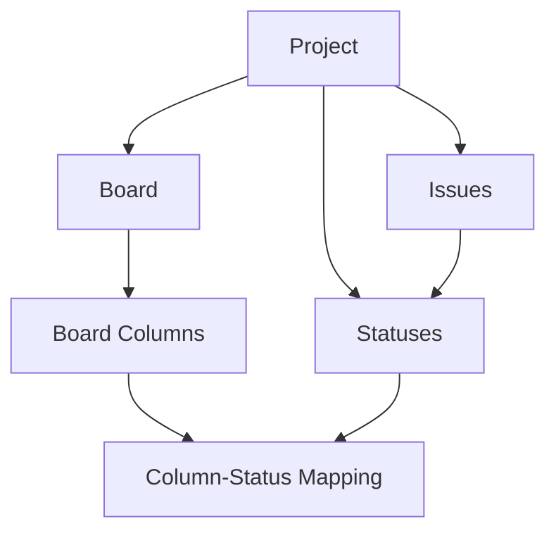

## What is a Board?

A board is a visual representation of issues in a project, organized into columns. Boards provide different views of the same underlying issues, helping teams visualize workflow, track progress, and manage work efficiently.

<Info>
  Boards are **views** of issues, not containers. Issues belong to projects, and boards display them based on filters and column configurations.
</Info>

## Why Boards Matter

Boards provide:

- **Visual workflow**: See work progress at a glance
- **Flexible views**: Multiple boards can show the same issues differently
- **Team collaboration**: Shared view of what everyone is working on
- **Drag-and-drop**: Move issues between statuses visually

## Key Fields

Based on the database schema, each board has:

```sql
CREATE TABLE boards (
  id UUID PRIMARY KEY,
  project_id UUID NOT NULL REFERENCES projects(id) ON DELETE CASCADE,
  name TEXT NOT NULL,
  type TEXT NOT NULL CHECK (type IN ('kanban', 'scrum')),
  filter_query TEXT NOT NULL DEFAULT '',
  created_at TIMESTAMPTZ NOT NULL,
  updated_at TIMESTAMPTZ NOT NULL,
  archived_at TIMESTAMPTZ,
  UNIQUE (project_id, name)
);
```

| Field | Type | Description |
|-------|------|-------------|
| `id` | UUID | Unique identifier |
| `project_id` | UUID | The project this board belongs to |
| `name` | Text | Display name (e.g., "Sprint Board") |
| `type` | Text | Board type: `kanban` or `scrum` |
| `filter_query` | Text | Filter to show subset of issues |
| `created_at` | Timestamp | When the board was created |
| `updated_at` | Timestamp | Last modification time |
| `archived_at` | Timestamp | If set, board is archived |

## Board Types

<CardGroup cols={2}>
  <Card title="Kanban" icon="water">
    Continuous flow board for ongoing work. Issues move through columns as work progresses. No time constraints.
  </Card>
  <Card title="Scrum" icon="calendar">
    Sprint-based board for time-boxed iterations. Designed for teams working in sprints with planning and retrospectives.
  </Card>
</CardGroup>

### Kanban Boards

Ideal for:
- Continuous delivery teams
- Support and maintenance work
- Projects without fixed iterations
- Work that flows constantly

**Example columns**: `Backlog → In Progress → Review → Done`

### Scrum Boards

Ideal for:
- Sprint-based development
- Time-boxed iterations (1-4 weeks)
- Teams with regular planning ceremonies
- Fixed scope increments

**Example columns**: `To Do → In Progress → In Review → Done`

## Board Columns

Columns organize issues visually on a board:

```sql
CREATE TABLE board_columns (
  id UUID PRIMARY KEY,
  board_id UUID NOT NULL REFERENCES boards(id) ON DELETE CASCADE,
  name TEXT NOT NULL,
  position INT NOT NULL CHECK (position >= 0),
  created_at TIMESTAMPTZ NOT NULL,
  updated_at TIMESTAMPTZ NOT NULL,
  archived_at TIMESTAMPTZ,
  UNIQUE (board_id, name),
  UNIQUE (board_id, position)
);
```

### Column Properties

- **Name**: Display label (e.g., "In Progress", "Code Review")
- **Position**: Order on the board (0, 1, 2, ...)
- **Status mapping**: One or more statuses can be assigned to each column

<Note>
  Columns are purely visual. The actual workflow is defined by [statuses](/concepts/statuses), which can be mapped to columns flexibly.
</Note>

## Status Mapping

The key to board flexibility is mapping statuses to columns:

```sql
CREATE TABLE board_column_statuses (
  board_column_id UUID NOT NULL REFERENCES board_columns(id) ON DELETE CASCADE,
  status_id UUID NOT NULL REFERENCES statuses(id) ON DELETE CASCADE,
  created_at TIMESTAMPTZ NOT NULL,
  PRIMARY KEY (board_column_id, status_id)
);
```

### How Mapping Works

Multiple statuses can map to a single column:

```
Column: "In Progress"
├── Status: "In Development"
├── Status: "In Code Review"
└── Status: "In Testing"

Column: "Done"
├── Status: "Deployed"
└── Status: "Closed"
```

This allows:
- **Granular workflow**: Define many statuses for detailed tracking
- **Simple visualization**: Group related statuses in columns
- **Multiple views**: Different boards can group statuses differently

### Data Integrity

<Warning>
  A status can only be assigned to columns on boards within the same project. This is enforced by the `validate_board_column_status_project()` database trigger.
</Warning>

## Board Filters

The `filter_query` field allows boards to show subsets of issues:

```
# Show only bugs
filter_query: "type = 'Bug'"

# Show high priority issues
filter_query: "priority IN ('high', 'critical')"

# Show issues assigned to current sprint
filter_query: "sprint = 'Sprint 23'"

# Show unassigned issues
filter_query: "assignee IS NULL"
```

<Info>
  Filters make it possible to have multiple focused boards (e.g., "Bug Board", "Feature Board") all showing different views of the same project.
</Info>

## Relationships

Boards connect issues to visual organization:



<CardGroup cols={2}>
  <Card title="Projects" icon="folder" href="/concepts/projects">
    Every board belongs to one project
  </Card>
  <Card title="Statuses" icon="list-check" href="/concepts/statuses">
    Columns display issues by status
  </Card>
  <Card title="Issues" icon="circle-check" href="/concepts/issues">
    Boards visualize project issues
  </Card>
</CardGroup>

## Real-World Examples

### Example 1: Software Development Team

**Board**: "Engineering Kanban" (type: `kanban`)
```
Columns:
├── Backlog → [Status: "Backlog"]
├── Ready → [Status: "Ready for Dev"]
├── In Progress → [Status: "In Development", "In Review"]
└── Done → [Status: "Deployed", "Closed"]

Filter: None (shows all issues)
```

### Example 2: Bug Tracking Board

**Board**: "Bug Board" (type: `kanban`)
```
Columns:
├── New → [Status: "Reported"]
├── Investigating → [Status: "In Progress"]
├── Fix Ready → [Status: "Ready to Deploy"]
└── Resolved → [Status: "Deployed"]

Filter: "type = 'Bug'"
```

### Example 3: Sprint Board

**Board**: "Sprint 23" (type: `scrum`)
```
Columns:
├── To Do → [Status: "Backlog", "Ready for Dev"]
├── In Progress → [Status: "In Development"]
├── Review → [Status: "In Review", "In QA"]
└── Done → [Status: "Done"]

Filter: "sprint = 'Sprint 23' AND type IN ('Story', 'Task')"
```

### Example 4: Support Team Board

**Board**: "Support Queue" (type: `kanban`)
```
Columns:
├── New Tickets → [Status: "New"]
├── In Progress → [Status: "Investigating", "Waiting on Customer"]
├── Resolved → [Status: "Resolved"]
└── Closed → [Status: "Closed"]

Filter: "type = 'Support Ticket' AND resolved_date IS NULL"
```

## Best Practices

<Note>
  **Start simple** - Begin with 3-4 columns that match your actual workflow. You can always add more granularity later.
</Note>

### Designing Columns

✅ **Good column design:**
- Reflects your actual workflow steps
- 3-6 columns (too many creates confusion)
- Clear boundaries between stages
- Matches how your team talks about work

❌ **Avoid:**
- Too many columns (more than 8)
- Columns that don't represent workflow stages
- Duplicate columns on the same board
- Columns with no status mapping

### Multiple Boards Strategy

**Create different boards for:**
- Different teams viewing the same project
- Different work types (features vs. bugs)
- Different time horizons (current sprint vs. backlog)
- Different stakeholders (engineering vs. management view)

**Example - Single project with multiple boards:**
```
Project: "Engineering" (ENG)

Board 1: "Team Kanban" (all work, detailed statuses)
Board 2: "Bug Board" (filtered to bugs only)
Board 3: "Executive View" (simplified columns, high-level)
Board 4: "Sprint 23" (filtered to current sprint)
```

### Status Mapping Tips

- **Many-to-one**: Multiple statuses can map to one column
- **Keep it flexible**: Don't be afraid to have different mappings on different boards
- **Match mental models**: Column names should make sense to the team using that board
- **Consider audiences**: Engineering boards might have more granular columns than stakeholder boards

## Moving Issues on Boards

When a user drags an issue to a different column:

1. The issue's `status_id` changes to one of the statuses mapped to that column
2. The issue's `status_position` updates to reflect its position in the column
3. Other issues' positions may shift to maintain order

See [Statuses](/concepts/statuses) for more on how status positioning works.

<Info>
  If a column has multiple statuses mapped, the system needs to determine which status to assign. This is typically the first/default status for that column.
</Info>

## Common Questions

<Accordion title="Can an issue appear on multiple boards?">
  Yes! Boards are just views. The same issue can appear on multiple boards in the same project, as long as it matches each board's filter.
</Accordion>

<Accordion title="What's the difference between columns and statuses?">
  Statuses are the actual workflow states an issue can be in (stored in the database). Columns are visual groupings on a board. One column can display multiple statuses.
</Accordion>

<Accordion title="How many boards should I create?">
  Start with 1-2 boards per project. Add more only when you have distinct audiences or workflows that need different views. Too many boards creates confusion.
</Accordion>

<Accordion title="Can I reorder columns?">
  Yes, columns have a `position` field (0, 1, 2, ...) that determines their order. This is unique per board, so you can't have two columns with the same position.
</Accordion>

<Accordion title="What happens when I archive a board?">
  The board is hidden from view (marked with `archived_at` timestamp), but no issues are affected. You can restore the board later, and all column configurations remain intact.
</Accordion>

<Accordion title="Can boards show issues from multiple projects?">
  No, each board belongs to exactly one project and can only display issues from that project. For cross-project views, you'd need a separate dashboard feature.
</Accordion>

## Next Steps

<CardGroup cols={2}>
  <Card title="Configure Statuses" icon="list-check" href="/concepts/statuses">
    Define the workflow states issues move through
  </Card>
  <Card title="Create Issues" icon="circle-plus" href="/concepts/issues">
    Add work items to visualize on boards
  </Card>
  <Card title="Learn About Projects" icon="folder" href="/concepts/projects">
    Understand how boards fit into project structure
  </Card>
</CardGroup>