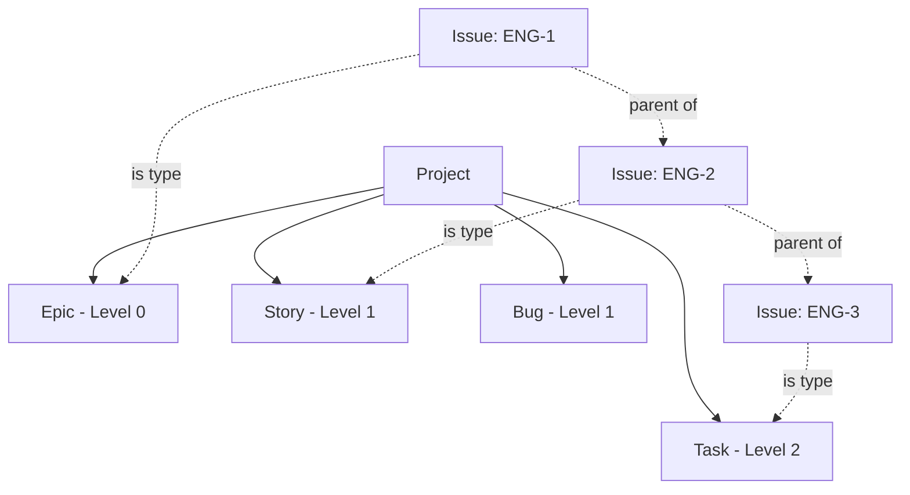

## What is an Issue Type?

An issue type categorizes the kind of work an issue represents. Common types include Epic, Story, Task, Bug, and Subtask. Issue types are project-specific and support hierarchical levels, allowing you to break down large work into smaller pieces (e.g., Epic → Story → Task).

<Info>
  Issue types support **hierarchical levels** (0, 1, 2, ...) which enable structured work breakdown from high-level initiatives to detailed tasks.
</Info>

## Why Issue Types Matter

Issue types provide:

- **Work categorization**: Distinguish features from bugs, tasks from epics
- **Hierarchical planning**: Break down large work into manageable pieces
- **Reporting flexibility**: Analyze work by type ("How many bugs this sprint?")
- **Visual distinction**: Different icons/colors on boards
- **Process customization**: Different workflows for different types

## Key Fields

Based on the database schema, each issue type has:

```sql
CREATE TABLE issue_types (
  id UUID PRIMARY KEY,
  project_id UUID NOT NULL REFERENCES projects(id) ON DELETE CASCADE,
  name TEXT NOT NULL,
  icon TEXT,
  level INT NOT NULL CHECK (level >= 0),
  created_at TIMESTAMPTZ NOT NULL,
  updated_at TIMESTAMPTZ NOT NULL,
  archived_at TIMESTAMPTZ,
  UNIQUE (project_id, name)
);
```

| Field | Type | Description |
|-------|------|-------------|
| `id` | UUID | Unique identifier |
| `project_id` | UUID | The project this type belongs to |
| `name` | Text | Display name (e.g., "Bug", "Story") |
| `icon` | Text | Optional icon identifier |
| `level` | Integer | Hierarchy level (0, 1, 2, ...) |
| `created_at` | Timestamp | When the type was created |
| `updated_at` | Timestamp | Last modification time |
| `archived_at` | Timestamp | If set, type is archived |

### Unique Constraints

- **Name uniqueness**: No two issue types in the same project can have the same name
- This prevents confusion when selecting issue types

## Hierarchical Levels

The `level` field enables parent-child relationships between issues:

```
Level 0: Epic (highest level, strategic initiatives)
Level 1: Story, Bug (mid-level work items)
Level 2: Task, Subtask (lowest level, detailed work)
Level 3: (optional) Fine-grained subtasks
```

### Level Rules

<CardGroup cols={2}>
  <Card title="Parent Level < Child Level" icon="arrow-down">
    A child issue must have a higher level than its parent
  </Card>
  <Card title="Level 0 = Top Level" icon="arrow-up">
    Lowest level number means highest in hierarchy
  </Card>
</CardGroup>

**Valid relationships:**
```
✅ Epic (level 0) → Story (level 1)
✅ Story (level 1) → Task (level 2)
✅ Epic (level 0) → Task (level 2)  (skipping level 1 is OK)
```

**Invalid relationships:**
```
❌ Story (level 1) → Epic (level 0)  (child level must be higher)
❌ Task (level 2) → Story (level 1)  (child level must be higher)
❌ Story (level 1) → Story (level 1) (child level must be higher)
```

<Warning>
  The database trigger `validate_issue_integrity()` enforces these rules. Attempting to create invalid hierarchies will result in an error.
</Warning>

## Common Type Configurations

### Software Development

```
Level 0: Epic (quarterly goals, major features)
Level 1: Story, Bug (user stories, defects)
Level 2: Task, Subtask (implementation work)
```

**Example hierarchy:**
```
Epic: "User Authentication System" (level 0)
├── Story: "User Login" (level 1)
│   ├── Task: "Design login form" (level 2)
│   ├── Task: "Implement authentication API" (level 2)
│   └── Task: "Add login validation" (level 2)
├── Story: "Password Reset" (level 1)
│   ├── Task: "Send reset email" (level 2)
│   └── Task: "Create reset form" (level 2)
└── Bug: "Login fails on Safari" (level 1)
    └── Task: "Fix Safari compatibility" (level 2)
```

### Marketing Campaign

```
Level 0: Campaign (overall campaign)
Level 1: Content Piece, Email, Social Post (deliverables)
Level 2: Task (individual work items)
```

**Example hierarchy:**
```
Campaign: "Q1 Product Launch" (level 0)
├── Content Piece: "Launch Blog Post" (level 1)
│   ├── Task: "Write draft" (level 2)
│   ├── Task: "Design graphics" (level 2)
│   └── Task: "Review and publish" (level 2)
├── Email: "Announcement Email" (level 1)
│   ├── Task: "Write copy" (level 2)
│   └── Task: "Design template" (level 2)
└── Social Post: "Twitter announcement" (level 1)
    └── Task: "Create graphics and schedule" (level 2)
```

### Support Workflow

```
Level 0: Incident (major issues affecting multiple customers)
Level 1: Ticket (individual customer requests)
Level 2: Follow-up (sub-tasks for resolution)
```

**Example hierarchy:**
```
Incident: "Database Performance Degradation" (level 0)
├── Ticket: "Customer A reporting slow queries" (level 1)
│   └── Follow-up: "Optimize query indexes" (level 2)
├── Ticket: "Customer B seeing timeouts" (level 1)
│   └── Follow-up: "Increase connection pool" (level 2)
└── Ticket: "Customer C experiencing errors" (level 1)
    └── Follow-up: "Fix error handling" (level 2)
```

### Simple Project (No Hierarchy)

```
Level 0: Task (all work items at same level)
```

For simple projects, you might not need hierarchy:
```
Task: "Design landing page" (level 0)
Task: "Write copy" (level 0)
Task: "Set up hosting" (level 0)
```

## Icons

The optional `icon` field can store an icon identifier:

```
Epic → "lightning-bolt"
Story → "book"
Task → "check-square"
Bug → "bug"
Subtask → "list"
```

Icons help with visual distinction on boards and lists, making it easy to scan and identify issue types quickly.

## Relationships

Issue types enable structured work breakdown:



<CardGroup cols={2}>
  <Card title="Projects" icon="folder" href="/concepts/projects">
    Every issue type belongs to one project
  </Card>
  <Card title="Issues" icon="circle-check" href="/concepts/issues">
    Each issue has one type
  </Card>
</CardGroup>

## Data Integrity

Taskcore enforces issue type integrity:

### Project Validation

```sql
validate_issue_integrity() trigger ensures:
- issue.issue_type_id must belong to the same project as the issue
```

You cannot assign an issue type from a different project.

### Hierarchy Validation

```sql
validate_issue_integrity() trigger ensures:
- child issue level must be greater than parent issue level
```

This prevents invalid hierarchies like Task → Story.

<Warning>
  These validations run at the database level and cannot be bypassed, ensuring data consistency even with direct database access.
</Warning>

## Best Practices

<Note>
  **Start simple** - Don't create too many issue types. Most projects work well with 3-5 types.
</Note>

### Choosing Issue Types

✅ **Good types:**
- **Epic** (level 0): Large initiatives, quarterly goals
- **Story** (level 1): User-facing features, user stories
- **Bug** (level 1): Defects, issues to fix
- **Task** (level 2): Individual work items, technical tasks
- **Subtask** (level 2): Breakdowns of tasks

❌ **Avoid:**
- Too many types (more than 7-8 becomes confusing)
- Overlapping definitions ("Task" vs "To-Do" - pick one)
- Status-like types ("Urgent" is a priority, not a type)
- Person-specific types ("Bob's Work" - use assignment instead)

### Level Assignment Guidelines

**Level 0** - Strategic, high-level:
- Represents months of work
- Contains multiple level 1 items
- Examples: Epic, Initiative, Campaign

**Level 1** - Tactical, mid-level:
- Represents days/weeks of work
- Can stand alone or contain level 2 items
- Examples: Story, Bug, Feature, Content Piece

**Level 2** - Execution, low-level:
- Represents hours/days of work
- Usually cannot have children
- Examples: Task, Subtask, Follow-up

**Level 3+** - Optional fine-grained breakdown:
- Only if you need extra granularity
- Most projects don't need beyond level 2

### Hierarchy Best Practices

1. **Keep it shallow**: 2-3 levels is usually enough
2. **Don't force it**: Not every issue needs a parent
3. **Group related work**: Use hierarchy to organize, not just categorize
4. **Think deliverables**: Parent should be a larger deliverable made of child deliverables
5. **Avoid deep nesting**: More than 3 levels becomes hard to manage

### When to Use Hierarchy

✅ **Use hierarchy when:**
- Breaking down large work into smaller pieces
- Tracking progress on multi-part initiatives
- Organizing related work under a common goal
- Planning releases or sprints

❌ **Don't use hierarchy for:**
- Linking related but independent issues
- Grouping by team or person
- Categorization (use issue types or labels instead)
- Dependencies (track separately)

## Real-World Examples

### Example 1: Building a Feature

```
ENG-100: Epic "Mobile App" (level 0)
├── ENG-101: Story "User Profile" (level 1)
│   ├── ENG-102: Task "Design profile UI" (level 2)
│   ├── ENG-103: Task "Implement profile API" (level 2)
│   └── ENG-104: Task "Add profile tests" (level 2)
├── ENG-105: Story "Settings Page" (level 1)
│   ├── ENG-106: Task "Design settings UI" (level 2)
│   └── ENG-107: Task "Implement settings logic" (level 2)
└── ENG-108: Bug "App crashes on iOS" (level 1)
    └── ENG-109: Task "Fix iOS crash" (level 2)
```

### Example 2: Marketing Campaign

```
MKT-50: Campaign "Product Launch" (level 0)
├── MKT-51: Content Piece "Launch Blog Post" (level 1)
│   ├── MKT-52: Task "Write draft" (level 2)
│   ├── MKT-53: Task "Create graphics" (level 2)
│   └── MKT-54: Task "Publish and promote" (level 2)
├── MKT-55: Email "Announcement Email" (level 1)
│   └── MKT-56: Task "Design and send" (level 2)
└── MKT-57: Social Post "Twitter thread" (level 1)
    └── MKT-58: Task "Write and schedule tweets" (level 2)
```

## Archiving Issue Types

When an issue type is archived:
- The `archived_at` timestamp is set
- It won't appear in dropdowns for new issues
- Existing issues keep their type
- It's hidden from configuration screens

<Warning>
  Don't archive issue types that have active issues you're still creating. Archived types can't be assigned to new issues.
</Warning>

## Common Questions

<Accordion title="How many issue types should I have?">
  Most projects work well with 3-5 issue types. Start simple (Story, Task, Bug) and add more only if you have a clear need. More than 8 types usually indicates over-complexity.
</Accordion>

<Accordion title="Can I change an issue type's level?">
  Yes, but be careful. Changing the level might break existing parent-child relationships if they become invalid (e.g., changing a Task from level 2 to level 0 would make it unable to be a child of a Story).
</Accordion>

<Accordion title="Do I need to use hierarchy?">
  No! Hierarchy is optional. Simple projects can use a single issue type at level 0 (e.g., just "Task") without any parent-child relationships.
</Accordion>

<Accordion title="Can an issue type be used in multiple projects?">
  No, issue types are project-specific. If you want consistency across projects, create the same issue types in each project. This allows flexibility if projects have different needs.
</Accordion>

<Accordion title="What's the difference between a Task and a Subtask?">
  It's up to you! Both could be level 2. The name distinction helps communicate intent (Tasks might stand alone, Subtasks always have a parent), but technically they work the same way.
</Accordion>

<Accordion title="Can I skip levels in hierarchy?">
  Yes! You can create an Epic (level 0) with direct Task (level 2) children, skipping level 1. The rule is only that child level must be higher than parent level.
</Accordion>

<Accordion title="How do I prevent creating invalid hierarchies?">
  The database automatically prevents invalid hierarchies. If you try to make a Task (level 2) the parent of a Story (level 1), the operation will fail with an error from the `validate_issue_integrity()` trigger.
</Accordion>

## Next Steps

<CardGroup cols={2}>
  <Card title="Create Issues" icon="circle-plus" href="/concepts/issues">
    Start using issue types in your work
  </Card>
  <Card title="Understand Hierarchies" icon="sitemap" href="/concepts/issues#issue-hierarchies">
    Learn more about parent-child relationships
  </Card>
  <Card title="Learn About Projects" icon="folder" href="/concepts/projects">
    Understand how issue types fit into projects
  </Card>
</CardGroup>