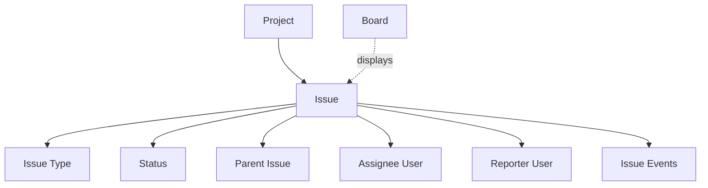

## What is an Issue?

An issue is the fundamental unit of work in Taskcore. It represents any trackable item: a feature, bug, task, story, epic, or any other work your team needs to complete. Issues belong to projects and are identified by a unique key combining the project key and a sequential number (e.g., `ENG-123`).

<Info>
  Every issue has a unique identifier like `ENG-123` where `ENG` is the project key and `123` is the sequential issue number within that project.
</Info>

## Why Issues Matter

Issues provide:

- **Work tracking**: Record what needs to be done
- **Collaboration**: Central place for discussion and updates
- **Progress visibility**: Track status through workflow stages
- **Accountability**: Assign work to team members
- **History**: Complete audit trail of changes

## Key Fields

Based on the database schema, each issue has:

```sql
CREATE TABLE issues (
  id UUID PRIMARY KEY,
  project_id UUID NOT NULL REFERENCES projects(id) ON DELETE CASCADE,
  number INT NOT NULL CHECK (number > 0),
  issue_type_id UUID NOT NULL REFERENCES issue_types(id),
  status_id UUID NOT NULL REFERENCES statuses(id),
  parent_issue_id UUID REFERENCES issues(id) ON DELETE SET NULL,
  title TEXT NOT NULL,
  description TEXT NOT NULL DEFAULT '',
  priority TEXT NOT NULL DEFAULT 'medium' CHECK (priority IN ('low', 'medium', 'high', 'critical')),
  assignee_id UUID REFERENCES app_users(id) ON DELETE SET NULL,
  reporter_id UUID NOT NULL REFERENCES app_users(id),
  due_date DATE,
  status_position INT NOT NULL DEFAULT 0 CHECK (status_position >= 0),
  created_at TIMESTAMPTZ NOT NULL,
  updated_at TIMESTAMPTZ NOT NULL,
  archived_at TIMESTAMPTZ,
  UNIQUE (project_id, number)
);
```

| Field | Type | Required | Description |
|-------|------|----------|-------------|
| `id` | UUID | Yes | Unique identifier |
| `project_id` | UUID | Yes | The project this issue belongs to |
| `number` | Integer | Yes | Sequential number within project |
| `issue_type_id` | UUID | Yes | Type of issue (Bug, Task, etc.) |
| `status_id` | UUID | Yes | Current workflow status |
| `parent_issue_id` | UUID | No | Parent issue for hierarchies |
| `title` | Text | Yes | Short description of the issue |
| `description` | Text | No | Detailed description |
| `priority` | Text | Yes | `low`, `medium`, `high`, or `critical` |
| `assignee_id` | UUID | No | Person responsible for the issue |
| `reporter_id` | UUID | Yes | Person who created the issue |
| `due_date` | Date | No | Target completion date |
| `status_position` | Integer | Yes | Position within its status column |
| `created_at` | Timestamp | Yes | When the issue was created |
| `updated_at` | Timestamp | Yes | Last modification time |
| `archived_at` | Timestamp | No | If set, issue is archived |

## Issue Identifier

Every issue is uniquely identified by `PROJECT_KEY-NUMBER`:

```
ENG-1     → First issue in Engineering project
ENG-2     → Second issue in Engineering project
MKT-1     → First issue in Marketing project
SALES-450 → 450th issue in Sales project
```

<Note>
  Issue numbers are sequential per project and never reused. If you delete `ENG-5`, the next issue is still `ENG-6`.
</Note>

## Priority Levels

<CardGroup cols={4}>
  <Card title="Low" icon="arrow-down">
    Minor improvements, nice-to-haves
  </Card>
  <Card title="Medium" icon="minus">
    Standard work, default priority
  </Card>
  <Card title="High" icon="arrow-up">
    Important work, should be prioritized
  </Card>
  <Card title="Critical" icon="exclamation">
    Urgent work, blocks other work
  </Card>
</CardGroup>

## Issue Hierarchies

Issues can have parent-child relationships, allowing you to break down large work into smaller pieces:

```
Epic (level 0): "User Authentication System"
├── Story (level 1): "User Login"
│   ├── Task (level 2): "Design login form"
│   ├── Task (level 2): "Implement authentication API"
│   └── Task (level 2): "Add login validation"
└── Story (level 1): "Password Reset"
    ├── Task (level 2): "Send reset email"
    └── Task (level 2): "Create reset form"
```

### Hierarchy Rules

Taskcore enforces strict hierarchy rules via database triggers:

1. **Same project**: Parent and child must be in the same project
2. **Level order**: Child level must be greater than parent level
3. **No cycles**: Cannot create circular relationships (A → B → C → A)

See [Issue Types](/concepts/issue-types) for more on levels.

<Warning>
  The database will reject any attempt to create invalid hierarchies. For example, you cannot make a Task (level 2) the parent of a Story (level 1).
</Warning>

## Status and Positioning

Issues have two position-related fields:

### Status ID

The current workflow state (e.g., "Backlog", "In Progress", "Done"). See [Statuses](/concepts/statuses).

### Status Position

The order of the issue within its status column:

```
Status: "In Progress"
├── ENG-45 (position: 0) ← top
├── ENG-12 (position: 1)
├── ENG-78 (position: 2)
└── ENG-34 (position: 3) ← bottom
```

<Info>
  Position is unique per (project, status) combination for active issues. This ensures consistent ordering on boards.
</Info>

When you move an issue:
1. The `status_id` changes to the new status
2. The `status_position` updates to the target position
3. Other issues' positions shift to maintain order

## Data Integrity

Taskcore enforces strict data integrity rules:

### Issue Type Validation

```sql
validate_issue_integrity() trigger checks:
- issue_type_id must belong to the same project
```

You cannot assign an issue type from a different project.

### Status Validation

```sql
validate_issue_integrity() trigger checks:
- status_id must belong to the same project
```

You cannot assign a status from a different project.

### Parent Issue Validation

```sql
validate_issue_integrity() trigger checks:
- parent_issue_id must belong to the same project
- child level must be greater than parent level
- no cycles in hierarchy
```

<Warning>
  These validations run at the database level, so they cannot be bypassed by application code. This ensures data consistency even with direct database access.
</Warning>

## Issue Events (Audit Trail)

Every change to an issue is recorded:

```sql
CREATE TABLE issue_events (
  id UUID PRIMARY KEY,
  issue_id UUID NOT NULL REFERENCES issues(id) ON DELETE CASCADE,
  actor_id UUID NOT NULL REFERENCES app_users(id),
  event_type TEXT NOT NULL CHECK (event_type IN ('created', 'updated', 'moved', 'commented')),
  payload_json JSONB NOT NULL DEFAULT '{}'::jsonb,
  created_at TIMESTAMPTZ NOT NULL
);
```

### Event Types

- **created**: Issue was created
- **updated**: Field was changed (title, description, priority, assignee, etc.)
- **moved**: Status or position changed
- **commented**: Comment was added

### Payload Examples

```json
// Updated event
{
  "field": "assignee_id",
  "old_value": "user-123",
  "new_value": "user-456"
}

// Moved event
{
  "old_status": "In Progress",
  "new_status": "Code Review",
  "old_position": 2,
  "new_position": 0
}

// Commented event
{
  "comment": "I've completed the API implementation"
}
```

## Relationships

Issues connect to many concepts:



<CardGroup cols={2}>
  <Card title="Projects" icon="folder" href="/concepts/projects">
    Every issue belongs to one project
  </Card>
  <Card title="Issue Types" icon="shapes" href="/concepts/issue-types">
    Categorizes the kind of work
  </Card>
  <Card title="Statuses" icon="list-check" href="/concepts/statuses">
    Tracks workflow progress
  </Card>
  <Card title="Boards" icon="table-columns" href="/concepts/boards">
    Visual representation of issues
  </Card>
</CardGroup>

## Real-World Examples

### Example 1: Feature Development

```
Issue: ENG-123
├── Type: Story
├── Status: In Progress
├── Priority: High
├── Title: "Add OAuth login support"
├── Description: "Users should be able to log in with Google/GitHub"
├── Assignee: Sarah (sarah@example.com)
├── Reporter: John (john@example.com)
├── Due Date: 2024-03-15
├── Parent: ENG-100 (Epic: "Authentication System")
└── Children: ENG-124, ENG-125, ENG-126 (implementation tasks)
```

### Example 2: Bug Report

```
Issue: WEB-45
├── Type: Bug
├── Status: Reported
├── Priority: Critical
├── Title: "Login page crashes on mobile Safari"
├── Description: "Stack trace: ..."
├── Assignee: Mike (mike@example.com)
├── Reporter: Support Team (support@example.com)
├── Due Date: 2024-03-01
└── Parent: None
```

### Example 3: Content Task

```
Issue: MKT-78
├── Type: Content Piece
├── Status: In Review
├── Priority: Medium
├── Title: "Write blog post about new features"
├── Description: "Cover OAuth, dark mode, and performance improvements"
├── Assignee: Emma (emma@example.com)
├── Reporter: Marketing Manager (manager@example.com)
├── Due Date: 2024-03-10
└── Parent: MKT-70 (Campaign: "Q1 Product Launch")
```

## Best Practices

<Note>
  **Write clear titles** - The title should be specific enough that someone unfamiliar with the context can understand what the issue is about.
</Note>

### Writing Good Titles

✅ **Good titles:**
- "Add OAuth login support for Google and GitHub"
- "Fix mobile Safari crash when submitting login form"
- "Optimize database query for user dashboard (currently 2s load time)"
- "Write documentation for new API authentication endpoints"

❌ **Avoid:**
- "Login stuff" (too vague)
- "Fix bug" (not specific)
- "Do the thing we talked about" (no context)
- "URGENT!!!" (use priority field instead)

### Using Descriptions

Good descriptions include:
- **Context**: Why is this work needed?
- **Requirements**: What specific outcomes are expected?
- **Acceptance criteria**: How will we know it's done?
- **Technical details**: Links, stack traces, designs, etc.

### Managing Hierarchies

- **Use sparingly**: Not every issue needs a parent/child relationship
- **Keep it shallow**: Avoid deep nesting (more than 3 levels)
- **Break down large work**: If an issue feels too big, create an Epic with child Stories
- **Link related work**: Use parent/child for true breakdowns, not just related issues

### Archiving vs. Deleting

- **Archive** when work is truly done and won't be revisited
- **Delete** only for mistakes (duplicate issues, test data)
- Archived issues remain in the database for reporting and history

## Common Questions

<Accordion title="Can I change an issue's project?">
  No, issues are permanently tied to their project. This ensures data integrity (status, issue type, and parent references must all be from the same project). Create a new issue in the target project if needed.
</Accordion>

<Accordion title="What happens to issue numbers when I delete issues?">
  The project counter never decrements. If you have `ENG-1` through `ENG-10` and delete `ENG-5`, the next new issue is still `ENG-11`, not `ENG-5`. This prevents confusion and maintains audit trails.
</Accordion>

<Accordion title="Can an issue have multiple assignees?">
  No, there's only one `assignee_id` field. If multiple people need to work on something, create child tasks and assign one person to each.
</Accordion>

<Accordion title="What's the difference between archived and done?">
  "Done" is a status (workflow state). "Archived" removes the issue from active views entirely. Archive issues that are truly finished and won't need updates.
</Accordion>

<Accordion title="How do I link related issues without parent/child?">
  Parent/child is for hierarchical breakdowns. For related work (duplicates, dependencies, etc.), mention the issue key in descriptions or comments (e.g., "Blocks ENG-123").
</Accordion>

<Accordion title="Can I reuse an issue number?">
  No, issue numbers are permanent and never reused within a project, even if you delete the issue. This ensures consistent referencing and prevents confusion.
</Accordion>

<Accordion title="What happens when I change an issue's status?">
  The `status_id` updates, `updated_at` timestamp changes, and an event is recorded in `issue_events`. The `status_position` may also update if you specify a new position.
</Accordion>

## Next Steps

<CardGroup cols={2}>
  <Card title="Define Issue Types" icon="shapes" href="/concepts/issue-types">
    Categorize different kinds of work
  </Card>
  <Card title="Configure Statuses" icon="list-check" href="/concepts/statuses">
    Set up your workflow stages
  </Card>
  <Card title="Visualize on Boards" icon="table-columns" href="/concepts/boards">
    See your issues in action
  </Card>
  <Card title="Learn About Projects" icon="folder" href="/concepts/projects">
    Understand issue organization
  </Card>
</CardGroup>