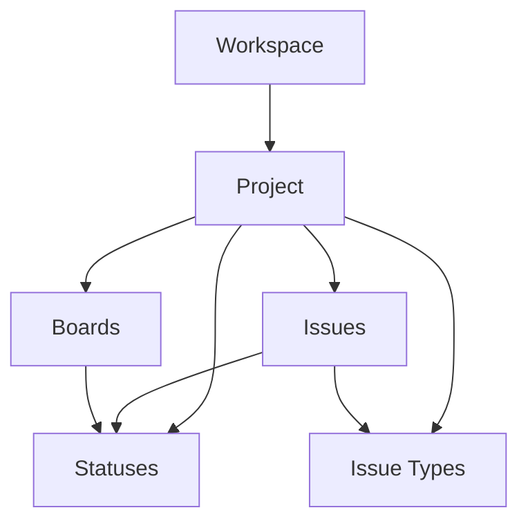

## What is a Project?

A project is a container for related work within a workspace. Each project has its own issues, boards, statuses, issue types, and team members. Projects are identified by a unique key (like `ENG` or `MKT`) that appears in issue identifiers.

<Info>
  Every issue in Taskcore belongs to exactly one project and is identified by a key-number combination like `ENG-123` or `MKT-45`.
</Info>

## Why Projects Matter

Projects provide:

- **Work organization**: Group related issues together (e.g., "Mobile App", "Website Redesign")
- **Custom workflows**: Each project has its own statuses and issue types
- **Team focus**: Different projects can have different members and permissions
- **Clear identification**: The project key makes it easy to reference issues

## Key Fields

Based on the database schema, each project has:

```sql
CREATE TABLE projects (
  id UUID PRIMARY KEY,
  workspace_id UUID NOT NULL REFERENCES workspaces(id) ON DELETE CASCADE,
  name TEXT NOT NULL,
  key TEXT NOT NULL,
  description TEXT NOT NULL DEFAULT '',
  created_at TIMESTAMPTZ NOT NULL,
  updated_at TIMESTAMPTZ NOT NULL,
  archived_at TIMESTAMPTZ,
  UNIQUE (workspace_id, key),
  CHECK (char_length(key) BETWEEN 2 AND 10),
  CHECK (key = UPPER(key))
);
```

| Field | Type | Description |
|-------|------|-------------|
| `id` | UUID | Unique identifier |
| `workspace_id` | UUID | The workspace this project belongs to |
| `name` | Text | Display name (e.g., "Engineering") |
| `key` | Text | 2-10 uppercase letters (e.g., "ENG") |
| `description` | Text | Project description |
| `created_at` | Timestamp | When the project was created |
| `updated_at` | Timestamp | Last modification time |
| `archived_at` | Timestamp | If set, project is archived |

### Project Key Requirements

The project key must:
- Be 2-10 characters long
- Use only uppercase letters (A-Z)
- Be unique within the workspace
- Be memorable and relevant (e.g., `ENG` for Engineering, `SALES` for Sales)

<Warning>
  Choose your project key carefully! It appears in every issue identifier (e.g., `ENG-123`) and can't be easily changed later.
</Warning>

## Project Members

Each project has its own team members with specific roles:

```sql
CREATE TABLE project_members (
  project_id UUID REFERENCES projects(id) ON DELETE CASCADE,
  user_id UUID REFERENCES app_users(id) ON DELETE CASCADE,
  role TEXT CHECK (role IN ('admin', 'member', 'viewer')),
  created_at TIMESTAMPTZ NOT NULL,
  updated_at TIMESTAMPTZ NOT NULL,
  archived_at TIMESTAMPTZ,
  PRIMARY KEY (project_id, user_id)
);
```

### Roles

<CardGroup cols={3}>
  <Card title="Admin" icon="shield">
    Full project control: manage settings, boards, and members
  </Card>
  <Card title="Member" icon="user">
    Create and edit issues, participate in project work
  </Card>
  <Card title="Viewer" icon="eye">
    Read-only access to issues and boards
  </Card>
</CardGroup>

<Note>
  Project roles are separate from workspace roles. A workspace member might be an admin on one project and a viewer on another.
</Note>

## Issue Numbering

Each project maintains its own counter for issue numbers:

```sql
CREATE TABLE project_issue_counters (
  project_id UUID PRIMARY KEY REFERENCES projects(id) ON DELETE CASCADE,
  last_number INT NOT NULL CHECK (last_number >= 0),
  created_at TIMESTAMPTZ NOT NULL,
  updated_at TIMESTAMPTZ NOT NULL
);
```

When you create an issue:
1. The counter increments: `1 → 2 → 3 → ...`
2. The issue gets assigned the next number
3. The issue key becomes: `PROJECT_KEY-NUMBER` (e.g., `ENG-123`)

<Info>
  Issue numbers are sequential per project, starting at 1. Even if you delete issue `ENG-5`, the next issue will be `ENG-6`, not `ENG-5`.
</Info>

## Relationships

Projects connect multiple concepts:



<CardGroup cols={2}>
  <Card title="Workspace" icon="building" href="/concepts/workspaces">
    Every project belongs to one workspace
  </Card>
  <Card title="Issues" icon="circle-check" href="/concepts/issues">
    Projects contain all your work items
  </Card>
  <Card title="Boards" icon="table-columns" href="/concepts/boards">
    Visualize project work in different ways
  </Card>
  <Card title="Statuses" icon="list-check" href="/concepts/statuses">
    Define project-specific workflows
  </Card>
</CardGroup>

## Real-World Examples

### Example 1: Engineering Team

```
Project: "Engineering" (ENG)
├── Issues: ENG-1, ENG-2, ... ENG-450
├── Boards: Sprint Board, Kanban, Bug Tracker
├── Statuses: Backlog, In Progress, Code Review, Done
├── Issue Types: Epic, Story, Task, Bug, Subtask
└── Members: 12 engineers + 2 product managers
```

### Example 2: Marketing Campaign

```
Project: "Q1 Campaign" (Q1C)
├── Issues: Q1C-1, Q1C-2, ... Q1C-78
├── Boards: Campaign Planning, Content Calendar
├── Statuses: Idea, In Progress, Review, Published
├── Issue Types: Campaign, Content Piece, Social Post, Email
└── Members: 5 marketers + 1 designer
```

### Example 3: Client Project

```
Project: "Website Redesign" (WEB)
├── Issues: WEB-1, WEB-2, ... WEB-234
├── Boards: Design Board, Development Board
├── Statuses: To Do, Doing, Client Review, Done
├── Issue Types: Page, Component, Content, Fix
└── Members: 3 developers + 2 designers + 2 client stakeholders
```

## Project Configuration

Each project can be customized with:

### Statuses

Define the workflow stages issues move through (see [Statuses](/concepts/statuses)):
- Unique to each project
- Categorized as `todo`, `doing`, or `done`
- Ordered by position

### Issue Types

Define the kinds of work your project tracks (see [Issue Types](/concepts/issue-types)):
- Unique to each project
- Support hierarchies (Epics → Stories → Subtasks)
- Can have custom icons

### Boards

Create different views of your work (see [Boards](/concepts/boards)):
- Multiple boards per project
- Kanban or Scrum types
- Filter issues by query

## Best Practices

<Note>
  **Keep projects focused** - A project should represent a cohesive body of work. If you find yourself needing completely different workflows, consider creating separate projects.
</Note>

### Choosing a Project Key

✅ **Good keys:**
- `ENG` - Engineering
- `MKT` - Marketing
- `SALES` - Sales
- `WEB` - Website
- `API` - API Development

❌ **Avoid:**
- `Q12024` - Contains numbers, tied to time period
- `PROJECT1` - Not descriptive
- `E` - Too short (minimum 2 characters)
- `ENGINEERING` - Too long (maximum 10 characters)

### Project Organization

- **One project per product or initiative** - Don't create a new project for every sprint or version
- **Use boards for views** - Instead of separate projects for "Bugs" and "Features", use one project with filtered boards
- **Set up workflows early** - Define statuses and issue types before creating many issues
- **Archive, don't delete** - Preserve project history by archiving instead of deleting

## Data Integrity

Taskcore enforces strict data integrity at the database level:

- **Cascade deletion**: If a workspace is deleted, all projects (and their issues) are deleted
- **Unique keys**: Project keys must be unique within a workspace
- **Issue references**: All issues must reference valid project-owned statuses and issue types

## Common Questions

<Accordion title="How many projects should I create?">
  Start with one project per major product or initiative. Most teams have 2-5 active projects. Too many projects makes it hard to find issues and manage workflows.
</Accordion>

<Accordion title="Can I change the project key?">
  Technically yes, but it's not recommended. Changing the key would affect all issue identifiers (e.g., `ENG-123` becomes `NEWKEY-123`), breaking links and causing confusion.
</Accordion>

<Accordion title="What's the difference between archiving and deleting?">
  Archiving sets the `archived_at` timestamp, hiding the project but preserving all data. Deletion permanently removes the project and all its issues. Always prefer archiving.
</Accordion>

<Accordion title="Can issues belong to multiple projects?">
  No, each issue belongs to exactly one project. This ensures clear ownership and consistent workflows. If you need to track related work across projects, use issue descriptions to link them.
</Accordion>

<Accordion title="What happens to issue numbers when I delete issues?">
  The counter never decrements. If you create `ENG-1`, `ENG-2`, `ENG-3` and delete `ENG-2`, the next issue will still be `ENG-4`. This prevents confusion and maintains audit trails.
</Accordion>

## Next Steps

<CardGroup cols={2}>
  <Card title="Create Issues" icon="circle-plus" href="/concepts/issues">
    Start tracking work in your project
  </Card>
  <Card title="Set Up Boards" icon="table-columns" href="/concepts/boards">
    Visualize your project workflow
  </Card>
  <Card title="Configure Statuses" icon="list-check" href="/concepts/statuses">
    Define your workflow stages
  </Card>
  <Card title="Define Issue Types" icon="shapes" href="/concepts/issue-types">
    Categorize different kinds of work
  </Card>
</CardGroup>