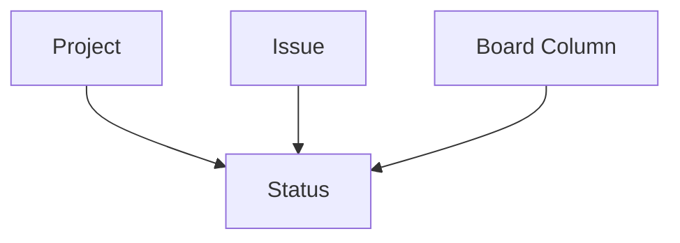

## What is a Status?

A status represents a stage in your workflow where an issue can be. Statuses define the journey an issue takes from creation to completion, such as "Backlog" → "In Progress" → "Code Review" → "Done". Each project has its own set of statuses, allowing teams to customize workflows.

<Info>
  Statuses are project-specific. Different projects can have completely different workflows tailored to their needs.
</Info>

## Why Statuses Matter

Statuses provide:

- **Workflow clarity**: Everyone knows what stage work is in
- **Progress tracking**: Visualize how work moves through your process
- **Team coordination**: Understand what needs attention at each stage
- **Bottleneck identification**: See where work gets stuck
- **Flexible processes**: Customize workflows per project

## Key Fields

Based on the database schema, each status has:

```sql
CREATE TABLE statuses (
  id UUID PRIMARY KEY,
  project_id UUID NOT NULL REFERENCES projects(id) ON DELETE CASCADE,
  name TEXT NOT NULL,
  category TEXT NOT NULL CHECK (category IN ('todo', 'doing', 'done')),
  position INT NOT NULL CHECK (position >= 0),
  created_at TIMESTAMPTZ NOT NULL,
  updated_at TIMESTAMPTZ NOT NULL,
  archived_at TIMESTAMPTZ,
  UNIQUE (project_id, name),
  UNIQUE (project_id, position)
);
```

| Field | Type | Description |
|-------|------|-------------|
| `id` | UUID | Unique identifier |
| `project_id` | UUID | The project this status belongs to |
| `name` | Text | Display name (e.g., "In Progress") |
| `category` | Text | Broad category: `todo`, `doing`, or `done` |
| `position` | Integer | Order in workflow (0, 1, 2, ...) |
| `created_at` | Timestamp | When the status was created |
| `updated_at` | Timestamp | Last modification time |
| `archived_at` | Timestamp | If set, status is archived |

### Unique Constraints

- **Name uniqueness**: No two statuses in the same project can have the same name
- **Position uniqueness**: No two statuses in the same project can have the same position

These constraints ensure consistent ordering and prevent confusion.

## Status Categories

Every status belongs to one of three categories:

<CardGroup cols={3}>
  <Card title="Todo" icon="circle">
    Work that hasn't started yet. Issues are waiting to be picked up.
  </Card>
  <Card title="Doing" icon="spinner">
    Work in progress. Someone is actively working on these issues.
  </Card>
  <Card title="Done" icon="circle-check">
    Completed work. Issues that have reached the finish line.
  </Card>
</CardGroup>

### Why Categories Matter

Categories enable:

- **High-level reporting**: "How many issues are in progress?"
- **Burndown charts**: Track work completion over time
- **WIP limits**: Restrict how many issues can be "doing"
- **Board configuration**: Group statuses logically on boards

<Note>
  Categories are broad groupings. Your project might have multiple statuses in each category (e.g., "In Development" and "In Review" are both `doing`).
</Note>

## Status Position

Statuses are ordered by `position` (0, 1, 2, ...):

```
Position  Status Name       Category
────────  ───────────────  ────────
0         Backlog           todo
1         Ready for Dev     todo
2         In Development    doing
3         Code Review       doing
4         Testing           doing
5         Ready to Deploy   done
6         Deployed          done
```

This order:
- Defines the logical workflow sequence
- Determines display order in status dropdowns
- Affects how [boards](/concepts/boards) layout columns
- Cannot have gaps (but you can reorder statuses)

## Common Workflows

### Basic Kanban

```
┌─────────┬─────────────┬──────┐
│ To Do   │ In Progress │ Done │
│ (todo)  │ (doing)     │(done)│
└─────────┴─────────────┴──────┘
```

**Status configuration:**
```
0: To Do (todo)
1: In Progress (doing)
2: Done (done)
```

### Software Development

```
┌─────────┬──────────────┬─────────────┬────────┬──────────┐
│ Backlog │ Ready for Dev│ In Dev      │ Review │ Done     │
│ (todo)  │ (todo)       │ (doing)     │(doing) │ (done)   │
└─────────┴──────────────┴─────────────┴────────┴──────────┘
```

**Status configuration:**
```
0: Backlog (todo)
1: Ready for Dev (todo)
2: In Development (doing)
3: Code Review (doing)
4: Testing (doing)
5: Done (done)
```

### Support Workflow

```
┌──────────┬──────────────┬─────────────────┬──────────┐
│ New      │ Investigating│ Waiting on Resp │ Resolved │
│ (todo)   │ (doing)      │ (doing)         │ (done)   │
└──────────┴──────────────┴─────────────────┴──────────┘
```

**Status configuration:**
```
0: New (todo)
1: Investigating (doing)
2: Waiting on Response (doing)
3: Resolved (done)
4: Closed (done)
```

### Content Creation

```
┌──────────┬────────┬──────────┬───────────┬───────────┐
│ Idea     │ Draft  │ Review   │ Approved  │ Published │
│ (todo)   │(doing) │ (doing)  │ (done)    │ (done)    │
└──────────┴────────┴──────────┴───────────┴───────────┘
```

**Status configuration:**
```
0: Idea (todo)
1: In Draft (doing)
2: In Review (doing)
3: Approved (done)
4: Published (done)
```

## Status on Boards

Statuses and board columns work together:

- **Statuses**: The actual workflow states (stored on each issue)
- **Board columns**: Visual groupings that can map to one or more statuses

See [Boards](/concepts/boards) for more on status-to-column mapping.

### Example

**Statuses defined:**
```
0: Backlog (todo)
1: Ready (todo)
2: In Development (doing)
3: Code Review (doing)
4: Testing (doing)
5: Done (done)
```

**Board columns:**
```
Column "To Do" → Maps to: [Backlog, Ready]
Column "In Progress" → Maps to: [In Development, Code Review, Testing]
Column "Done" → Maps to: [Done]
```

This allows granular status tracking while keeping the board visual simple.

## Relationships

Statuses connect issues to workflow:



<CardGroup cols={2}>
  <Card title="Projects" icon="folder" href="/concepts/projects">
    Every status belongs to one project
  </Card>
  <Card title="Issues" icon="circle-check" href="/concepts/issues">
    Issues track their current status
  </Card>
  <Card title="Boards" icon="table-columns" href="/concepts/boards">
    Columns display issues by status
  </Card>
</CardGroup>

## Data Integrity

Taskcore enforces status integrity:

### Project Validation

```sql
validate_issue_integrity() trigger ensures:
- issue.status_id must belong to the same project as the issue
```

You cannot assign a status from a different project to an issue.

### Board Validation

```sql
validate_board_column_status_project() trigger ensures:
- board columns can only be mapped to statuses from the same project
```

This prevents cross-project status confusion.

<Warning>
  These validations run at the database level and cannot be bypassed, ensuring data consistency even with direct database access.
</Warning>

## Issue Positioning Within Status

Issues maintain their order within each status via `status_position`:

```
Status: "In Progress"
├── ENG-45 (position: 0) ← top
├── ENG-12 (position: 1)
├── ENG-78 (position: 2)
└── ENG-34 (position: 3) ← bottom
```

This allows:
- Drag-and-drop reordering on boards
- Consistent display order
- Priority within workflow stages

See [Issues](/concepts/issues) for more details.

## Best Practices

<Note>
  **Keep it simple** - Start with 3-5 statuses. You can always add more as your process evolves.
</Note>

### Naming Statuses

✅ **Good names:**
- "In Progress" (clear, universally understood)
- "Code Review" (specific workflow stage)
- "Waiting on Client" (explains blockage)
- "Ready to Deploy" (actionable state)

❌ **Avoid:**
- "Status 1", "Status 2" (not descriptive)
- "Bob's stuff" (person-specific, not stage-specific)
- "Almost done" (vague)
- "Fix this later" (not a real workflow stage)

### Choosing Categories

**Todo** - Work that hasn't been started:
- Backlog
- Ready for Dev
- Awaiting Approval
- Planned

**Doing** - Active work in progress:
- In Development
- Code Review
- Testing
- Waiting on Response
- In Design

**Done** - Completed work:
- Deployed
- Closed
- Resolved
- Published
- Verified

### Workflow Design Tips

1. **Match reality**: Model your actual process, not an ideal one
2. **Clear boundaries**: Each status should have a clear definition
3. **Avoid duplicates**: Don't have multiple statuses that mean the same thing
4. **Consider handoffs**: Add statuses where work changes hands
5. **Include blocked states**: If work gets stuck, make it visible ("Blocked", "Waiting on...")

### Status Evolution

Your workflow will change over time:

- **Start simple**: Begin with basic statuses
- **Identify bottlenecks**: Add statuses to make problems visible
- **Merge redundant**: Combine statuses that aren't useful
- **Archive unused**: Don't delete; archive old statuses to preserve history

## Archiving Statuses

When a status is archived:
- The `archived_at` timestamp is set
- It won't appear in dropdowns for new issues
- Existing issues keep their status (but can't be changed to other statuses)
- It's hidden from boards and reports

<Warning>
  Don't archive statuses that have active issues. Move those issues to appropriate statuses first.
</Warning>

## Common Questions

<Accordion title="How many statuses should I have?">
  Start with 3-5 statuses representing your core workflow. Most teams end up with 5-8 statuses. More than 10 usually indicates over-complexity.
</Accordion>

<Accordion title="Can I reorder statuses?">
  Yes, update the `position` field. The unique constraint ensures no two statuses have the same position in a project.
</Accordion>

<Accordion title="Can I rename a status?">
  Yes, just update the `name` field. All issues with that status will reflect the new name immediately.
</Accordion>

<Accordion title="What happens if I delete a status with issues?">
  Best practice is to move issues to another status first, then archive (not delete) the old status. Deletion would fail if issues reference it due to foreign key constraints.
</Accordion>

<Accordion title="Can statuses be shared across projects?">
  No, each project has its own statuses. This allows different projects to have different workflows. If you want consistency, create the same statuses in multiple projects.
</Accordion>

<Accordion title="Should I use 'Closed' or 'Done' for completed work?">
  Either works! Choose terminology that matches how your team talks about work. Some teams use both: "Done" (work complete) and "Closed" (issue archived).
</Accordion>

<Accordion title="How do categories affect reporting?">
  Categories enable high-level metrics like "30% of issues are in progress (doing category)" without needing to know specific status names. This is useful for cross-project reports.
</Accordion>

## Next Steps

<CardGroup cols={2}>
  <Card title="Create Issues" icon="circle-plus" href="/concepts/issues">
    Start moving issues through your workflow
  </Card>
  <Card title="Set Up Boards" icon="table-columns" href="/concepts/boards">
    Visualize status transitions on boards
  </Card>
  <Card title="Learn About Projects" icon="folder" href="/concepts/projects">
    Understand how statuses fit into projects
  </Card>
</CardGroup>