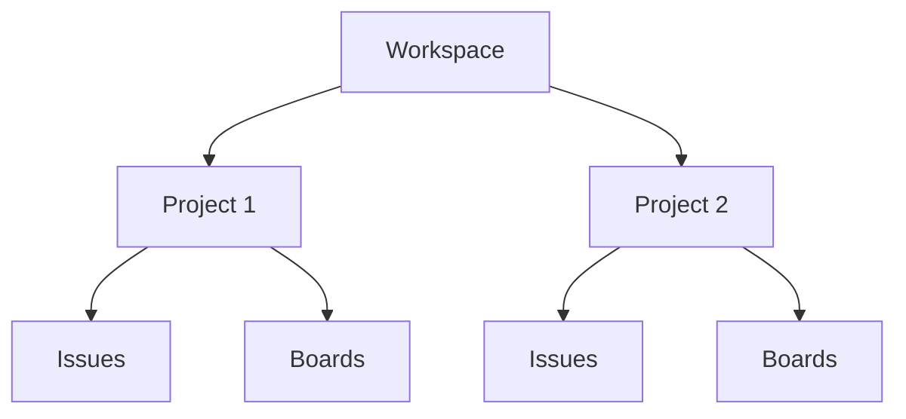

## What is a Workspace?

A workspace is the top-level organizational unit in Taskcore. Think of it as your team's home base where all your projects, boards, and issues live. Each workspace has its own members, settings, and projects.

<Info>
  Workspaces are identified by a unique **slug** (like `acme-corp` or `my-team`) that appears in URLs and makes sharing easy.
</Info>

## Why Workspaces Matter

Workspaces provide:

- **Team isolation**: Keep different teams or organizations completely separate
- **Centralized member management**: Control who has access to all projects in the workspace
- **Consistent branding**: Each workspace can have its own identity
- **Clear boundaries**: All projects, issues, and data belong to a single workspace

## Key Fields

Based on the database schema, each workspace has:

```sql
CREATE TABLE workspaces (
  id UUID PRIMARY KEY,
  name TEXT NOT NULL,
  slug TEXT NOT NULL UNIQUE,
  created_at TIMESTAMPTZ NOT NULL,
  updated_at TIMESTAMPTZ NOT NULL,
  archived_at TIMESTAMPTZ
);
```

| Field | Type | Description |
|-------|------|-------------|
| `id` | UUID | Unique identifier |
| `name` | Text | Display name (e.g., "Acme Corp") |
| `slug` | Text | URL-friendly identifier (e.g., "acme-corp") |
| `created_at` | Timestamp | When the workspace was created |
| `updated_at` | Timestamp | Last modification time |
| `archived_at` | Timestamp | If set, workspace is archived |

### Slug Requirements

The workspace slug must:
- Be 2-50 characters long
- Use only lowercase letters, numbers, or hyphens
- Start with a letter or digit
- Be globally unique across all workspaces

## Workspace Members

Every workspace has members with specific roles:

```sql
CREATE TABLE workspace_members (
  workspace_id UUID REFERENCES workspaces(id),
  user_id UUID REFERENCES app_users(id),
  role TEXT CHECK (role IN ('owner', 'admin', 'member')),
  created_at TIMESTAMPTZ NOT NULL,
  updated_at TIMESTAMPTZ NOT NULL,
  archived_at TIMESTAMPTZ,
  PRIMARY KEY (workspace_id, user_id)
);
```

### Roles

<CardGroup cols={3}>
  <Card title="Owner" icon="crown">
    Full control including billing and workspace deletion
  </Card>
  <Card title="Admin" icon="shield">
    Manage projects, members, and settings
  </Card>
  <Card title="Member" icon="user">
    Access projects they're added to
  </Card>
</CardGroup>

## Relationships

Workspaces are the foundation of Taskcore's hierarchy:



<CardGroup cols={2}>
  <Card title="Projects" icon="folder" href="/concepts/projects">
    Workspaces contain multiple projects
  </Card>
  <Card title="Users" icon="users">
    Users can be members of multiple workspaces
  </Card>
</CardGroup>

## Real-World Examples

### Scenario 1: Single Company

```
Workspace: "acme-corp"
├── Projects: Engineering, Marketing, Sales
└── Members: 50 employees
```

### Scenario 2: Agency with Multiple Clients

```
Workspace: "client-a"
├── Projects: Website Redesign, Mobile App
└── Members: 5 agency staff + 3 client stakeholders

Workspace: "client-b"
├── Projects: E-commerce Platform
└── Members: 5 agency staff + 2 client stakeholders
```

### Scenario 3: Personal Projects

```
Workspace: "john-personal"
├── Projects: Side Project, Learning, House Renovation
└── Members: Just you (plus collaborators as needed)
```

## Best Practices

<Note>
  **One workspace per team or client** - Don't try to mix unrelated work in the same workspace. The isolation helps with security and organization.
</Note>

- Use descriptive slugs that won't change (avoid dates or versions)
- Set up workspace members before creating projects
- Archive workspaces instead of deleting them to preserve history
- Use the `owner` role sparingly (only for people who should control billing)

## Archiving Workspaces

When a workspace is archived:
- The `archived_at` timestamp is set
- All contained projects and issues remain accessible (read-only)
- No new projects can be created
- Members can't make changes

<Warning>
  Archiving a workspace cascades to all projects, boards, and issues within it due to `ON DELETE CASCADE` constraints in the database.
</Warning>

## Common Questions

<Accordion title="Can I move a project between workspaces?">
  No, projects are permanently tied to their workspace. This ensures data integrity and access control. If you need to reorganize, create a new project in the target workspace and migrate issues manually.
</Accordion>

<Accordion title="How many workspaces can I create?">
  There's no technical limit, but most users only need 1-3 workspaces. Each workspace should represent a distinct team or organizational boundary.
</Accordion>

<Accordion title="What happens to workspace members when archived?">
  Member records remain in the database with their `archived_at` timestamp set. They can be reactivated if the workspace is restored.
</Accordion>

<Accordion title="Can workspace slugs be changed?">
  Yes, but be careful! Changing a slug will break any bookmarked URLs or API integrations that reference the old slug.
</Accordion>

## Next Steps

<CardGroup cols={2}>
  <Card title="Create Your First Project" icon="folder-plus" href="/concepts/projects">
    Learn how to organize work within your workspace
  </Card>
  <Card title="Invite Team Members" icon="user-plus">
    Add collaborators to your workspace
  </Card>
</CardGroup>