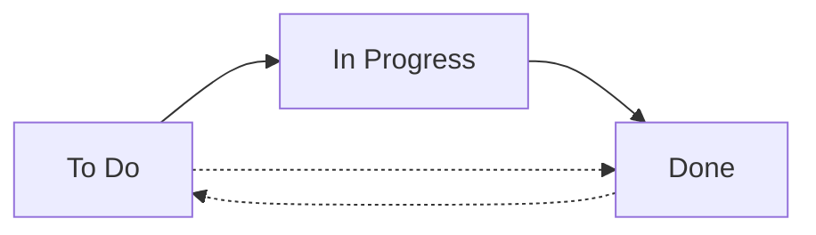

Workflows define how work moves through your team's process. Customize statuses and transitions to match exactly how your team operates.

## Understanding Workflows

A workflow consists of:

- **Statuses**: The states an issue can be in (e.g., "To Do", "In Progress", "Done")
- **Transitions**: The allowed moves between statuses
- **Categories**: Groupings that determine where statuses appear (Todo, Doing, Done)

<Note>
Every project has its own set of statuses. Changes to one project's workflow don't affect others.
</Note>

## Default Workflow

New projects start with a simple three-status workflow:



- **To Do**: Work that hasn't started
- **In Progress**: Work currently being done
- **Done**: Completed work

In the MVP, transitions are allowed between ANY statuses, giving maximum flexibility.

## Managing Statuses

### Creating New Statuses

<Steps>
  <Step title="Open Project Settings">
    Navigate to **Project Settings** > **Workflows** > **Statuses**
  </Step>

  <Step title="Add Status">
    Click **Add Status** and configure:
    
    - **Name**: Clear, action-oriented name (required, unique per project)
    - **Category**: Todo, Doing, or Done
    - **Position**: Where it appears in the list
  </Step>

  <Step title="Save and Use">
    Click **Create**. The new status is immediately available on all boards and can be assigned to board columns.
  </Step>
</Steps>

### Status Categories

Categories help organize statuses and provide semantic meaning:

<Tabs>
  <Tab title="Todo">
    **Meaning**: Work not yet started
    
    **Examples**:
    - Backlog
    - To Do
    - Ready for Development
    - Planned
    
    **Use for**: Issues waiting to be picked up
  </Tab>

  <Tab title="Doing">
    **Meaning**: Work in progress
    
    **Examples**:
    - In Progress
    - In Development
    - Code Review
    - Testing
    - Waiting for Customer
    
    **Use for**: Active work that hasn't completed
  </Tab>

  <Tab title="Done">
    **Meaning**: Work completed
    
    **Examples**:
    - Done
    - Closed
    - Deployed
    - Resolved
    - Verified
    
    **Use for**: Finished work
  </Tab>
</Tabs>

### Editing Statuses

1. Go to **Project Settings** > **Workflows** > **Statuses**
2. Click the **•••** menu next to a status
3. Select **Edit**
4. Update the name, category, or position
5. Click **Save**

<Note>
Changing a status name updates all existing issues using that status.
</Note>

### Reordering Statuses

1. Go to **Project Settings** > **Workflows** > **Statuses**
2. Drag statuses up or down using the handle (⋮⋮)
3. Changes save automatically

Status order affects:
- How they appear in dropdowns
- Default board column ordering
- Reports and visualizations

### Archiving Statuses

1. Go to **Project Settings** > **Workflows** > **Statuses**
2. Click **•••** next to the status
3. Select **Archive**
4. Confirm the action

<Note>
You cannot archive a status if issues are currently using it. First, move those issues to a different status.
</Note>

## Workflow Examples by Team

### Software Development Team

**Status Flow**:
```
Backlog → To Do → In Development → Code Review → 
QA Testing → Ready to Deploy → Done
```

**Statuses**:
- **Backlog** (Todo): Prioritized but not committed
- **To Do** (Todo): Committed for current sprint
- **In Development** (Doing): Developer actively coding
- **Code Review** (Doing): Awaiting peer review
- **QA Testing** (Doing): Being tested
- **Ready to Deploy** (Doing): Passed all checks
- **Done** (Done): Deployed to production

### Support Team

**Status Flow**:
```
New → Triaged → In Progress → Waiting on Customer → 
Resolved → Closed
```

**Statuses**:
- **New** (Todo): Just reported
- **Triaged** (Todo): Reviewed and prioritized
- **In Progress** (Doing): Agent working on it
- **Waiting on Customer** (Doing): Need customer info
- **Resolved** (Done): Solution provided
- **Closed** (Done): Customer confirmed fix

### Marketing Team

**Status Flow**:
```
Ideas → Planned → In Progress → Review → 
Scheduled → Published
```

**Statuses**:
- **Ideas** (Todo): Brainstormed concepts
- **Planned** (Todo): Approved for execution
- **In Progress** (Doing): Being created
- **Review** (Doing): Stakeholder approval
- **Scheduled** (Doing): Queued for publishing
- **Published** (Done): Live

### Design Team

**Status Flow**:
```
Request → Scoping → Design → Review → 
Revisions → Approved → Delivered
```

**Statuses**:
- **Request** (Todo): New design request
- **Scoping** (Todo): Understanding requirements
- **Design** (Doing): Creating designs
- **Review** (Doing): Team/stakeholder feedback
- **Revisions** (Doing): Incorporating feedback
- **Approved** (Done): Design finalized
- **Delivered** (Done): Assets handed off

## Status Naming Best Practices

<Tip>
**Be Specific**: "Code Review" is clearer than "Review"
</Tip>

<Tip>
**Use Action Words**: "In Testing" or "Testing" rather than "Test"
</Tip>

<Tip>
**Avoid Ambiguity**: "Done" is clearer than "Complete" or "Finished"
</Tip>

<Tip>
**Match Your Language**: Use terms your team already uses in conversation
</Tip>

<Tip>
**Keep It Short**: Status names appear in many places—keep them concise
</Tip>

## Workflow Design Tips

### Start Simple

Begin with 3-5 statuses and add more only when needed:

**Minimum Viable Workflow**:
- To Do (Todo)
- In Progress (Doing)  
- Done (Done)

**Evolve as needed**:
- Split "In Progress" into "Development" + "Review"
- Add "Blocked" when issues get stuck
- Add "Testing" when QA joins the team

### Reflect Reality

Design workflows that match how work actually flows:

❌ **Theory**: Backlog → To Do → Done

✅ **Reality**: Backlog → To Do → Development → Code Review → QA → Blocked → QA → Done

### Identify Bottlenecks

Use status data to spot problems:

- If many issues sit in "Code Review", you may need more reviewers
- If "Blocked" status is common, improve dependency management
- If "Testing" overflows, QA may need more resources

### Limit Work in Progress

Consider WIP limits for statuses:

- Max 3 issues per person in "In Development"
- Max 10 issues total in "Code Review"
- No limits on "Backlog" or "Done"

<Note>
WIP limits are not enforced by Taskcore in the MVP but can be monitored manually.
</Note>

## Transitions (Future Enhancement)

In the current MVP, issues can move from any status to any other status freely.

**Coming Soon**: Restricted transitions will allow you to:

- Define which status changes are allowed
- Prevent issues from skipping required steps
- Require certain fields before transitions (e.g., "Assignee required before In Progress")
- Add validation rules

**Example restricted workflow**:
```
To Do → In Progress → Code Review → Done
         ↓                ↓
      Blocked ←————————————┘
```

In this example:
- Issues can't go directly from "To Do" to "Done"
- "Blocked" can only be reached from "In Progress" or "Code Review"
- Work must flow through the defined path

## Mapping Statuses to Board Columns

Remember: Statuses and board columns are separate concepts:

- **Status**: The actual state of an issue in your workflow
- **Column**: A visual grouping on a board

### One-to-One Mapping

**Simple approach**: Each status gets its own column

| Column | Statuses |
|--------|----------|
| To Do | To Do |
| In Progress | In Progress |
| Review | Code Review |
| Done | Done |

### Many-to-One Mapping

**Advanced approach**: Group multiple statuses per column

| Column | Statuses |
|--------|----------|
| Backlog | Backlog, Ideas |
| To Do | To Do, Ready |
| In Progress | Development, Review, Testing |
| Done | Deployed, Closed |

This simplifies the board while maintaining detailed status tracking.

## Common Workflow Patterns

### Linear Flow

Work moves forward through stages:

```
A → B → C → D → E
```

**Best for**: Predictable processes, assembly-line work

### Parallel Flow

Multiple independent tracks:

```
        ┌→ Design → Design Review ┐
Planned ┤                          ├→ Done
        └→ Development → Code Review ┘
```

**Best for**: Work with parallel workstreams

### Cyclical Flow

Work loops back for revisions:

```
To Do → In Progress → Review
          ↑              ↓
          └─── Revisions ┘
```

**Best for**: Creative work, iterative processes

### Conditional Flow

Different paths based on issue type:

```
           ┌→ Fast Track → Done
To Do → Triage ┤
           └→ Standard → Development → Review → Done
```

**Best for**: Support tickets, mixed work types

## Measuring Workflow Effectiveness

### Cycle Time

Track how long issues spend in each status:

1. Go to **Reports** > **Workflow Analysis**
2. View average time per status
3. Identify slow stages

### Throughput

Measure issues completed per time period:

- Daily: How many reached "Done" today?
- Weekly: Completion trend over time
- By team member: Individual throughput

### Status Distribution

See where work is accumulating:

- Too many in "To Do"? You're planning faster than executing
- Too many in "Review"? You need more reviewers
- Too many in "Blocked"? Dependency issues

## Next Steps

<CardGroup cols={2}>
  <Card title="Configuring Boards" icon="columns" href="/guides/configuring-boards">
    Map your workflow statuses to board columns
  </Card>
  
  <Card title="Managing Issues" icon="list-check" href="/guides/managing-issues">
    Move issues through your workflow
  </Card>
  
  <Card title="Team Collaboration" icon="users" href="/guides/team-collaboration">
    Work together on issues
  </Card>
  
  <Card title="Creating Projects" icon="folder-plus" href="/guides/creating-projects">
    Set up new projects with custom workflows
  </Card>
</CardGroup>